# SettleOne — Intelligent Settlement Infrastructure

> **Risk-aware settlement infrastructure for capital that doesn't have to sit idle.**

SettleOne is an intelligent settlement infrastructure platform that combines **on-chain escrow, explicit risk policies, deterministic strategy evaluation, DeFi yield management, blockchain data, and AI-powered risk monitoring** to manage eligible settlement capital while keeping settlement safety as the primary objective.

Instead of treating escrow as capital that simply waits until settlement, SettleOne creates a controlled environment in which eligible escrow capital can be evaluated for temporary DeFi deployment under predefined risk and settlement constraints.

**Settlement safety comes first. Yield is secondary.**

---

[**Open SettleOne →**](https://settle-one-marketing.vercel.app/)

## Table of Contents
- [Overview](#overview)
- [The Problem](#the-problem)
- [The SettleOne Approach](#the-settleone-approach)
- [Core Principles](#core-principles)
- [How SettleOne Works](#how-settleone-works)
- [Product Workflow](#product-workflow)
- [DeFi Yield Layer](#defi-yield-layer)
- [The Graph Data Layer](#the-graph-data-layer)
- [AI Risk Monitor](#ai-risk-monitor)
- [Automated Risk Response](#automated-risk-response)
- [Settlement](#settlement)
- [System Architecture](#system-architecture)
- [Security Model](#security-model)
- [Risk & Loss Model](#risk--loss-model)
- [Technology Stack](#technology-stack)
- [Contract Addresses](#contract-addresses)
- [Security Disclosure](#security-disclosure)
- [License](#license)
  
---

## ETHOnline Hackathon Achievements

SettleOne underwent rapid development and massive feature wiring during the ETHOnline hackathon. Key milestones achieved include:

### [**Frontend**](https://github.com/SettleOne/settleOne)

- **Wired up End-to-End Deal Flow:** Successfully connected Deal Creation, Deal Funding, Deal Accepting, and Delivery Submission logic directly to smart contracts and the backend.

- **Marketplace & Deal Room:** Built robust marketplace filtering logic and implemented real-time on-chain ID syncing.

- **Documentation:** Built and integrated the extensive developer and marketing documentation portal.

### [**Backend**](https://github.com/SettleOne/settleOne-backend)

- **Blockchain Indexers:** Successfully deployed background watchers tracking real-time on-chain events and syncing with the Prisma database.

- **Email & Auth:** Fixed critical email OTP flows and wired up multi-app authentication.

- **API & Schemas:** Finalized the create-deal schema, marketplace filtering APIs, and interconnected the deal submission lifecycle.

### [**Smart Contracts**](https://settle-one-marketing.vercel.app/docs)

- **Security & Auditing:** Completed extensive internal auditing of the Deal Manager, Escrow Vault, and Settlement contracts.

---

# Overview

Traditional escrow solves an important problem: **capital is locked until contractual conditions are satisfied.**

However, during that period, capital can remain economically idle.

SettleOne explores a different model:

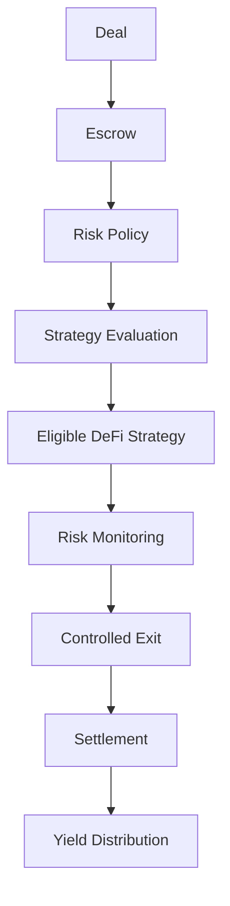

The objective is not simply to maximize APY.

The objective is to determine:

> **Can this escrow capital be productively managed without violating the conditions required for safe settlement?**

If the answer is no, capital should remain idle or exit the strategy.

---

# The Problem

Settlement capital can remain locked for days or weeks.

During this period:

- capital may generate no return;

- participants have limited visibility into the capital's status;

- yield opportunities may exist but carry additional risk;

- settlement deadlines introduce time-sensitive liquidity requirements;

- DeFi positions can change after the initial strategy decision;

- manually monitoring positions does not scale.

Simply depositing escrow funds into a yield protocol is also insufficient.

A settlement system needs to understand:

- how much capital can be exposed;

- how much drawdown is acceptable;

- how much liquidity must remain available;

- when the position must be unwound;

- who bears losses;

- how yield is accounted for;

- how anomalies are detected;

- how settlement remains executable.

---

# The SettleOne Approach

SettleOne separates the problem into distinct layers:

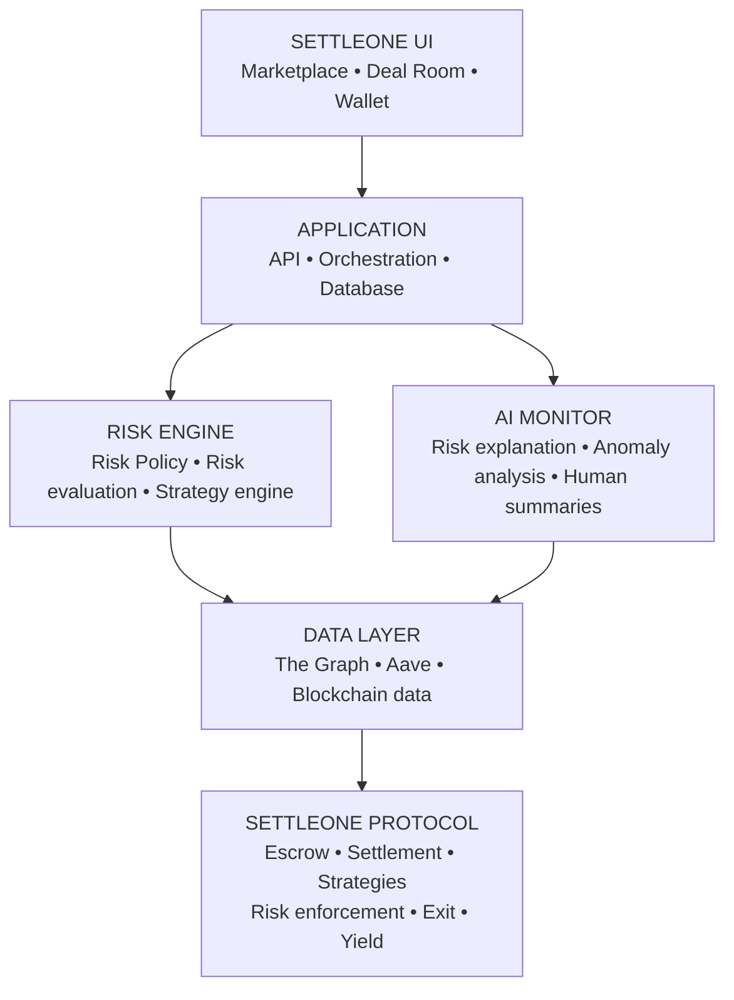

The architectural rule is:

> **AI explains. Deterministic systems evaluate. Smart contracts enforce.**

---

# Core Principles

### 1. Settlement safety over yield

The system should prefer a lower-yield strategy—or no strategy—when a higher-yield strategy introduces unacceptable settlement risk.

### 2. Explicit risk policies

Risk should never be an implicit assumption.

Each eligible deal should have explicit constraints.

### 3. Deterministic financial decisions

Financial execution should not depend on an LLM's arbitrary output.

### 4. AI as a monitoring and explanation layer

AI helps interpret risk and communicate what is happening.

It does not own funds or receive unrestricted authority over financial execution.

### 5. Transparent accounting

Principal and yield should always be distinguishable.

### 6. Controlled strategy exposure

Only approved strategies should be executable by the protocol.

### 7. Time-aware settlement

A strategy must account for the settlement deadline and required liquidity buffer.

---

# How SettleOne Works

A typical yield-enabled deal follows:

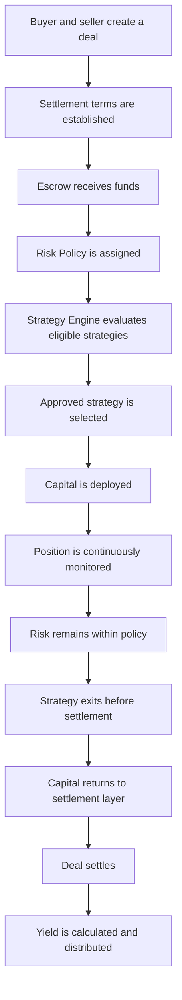

If risk constraints are breached:

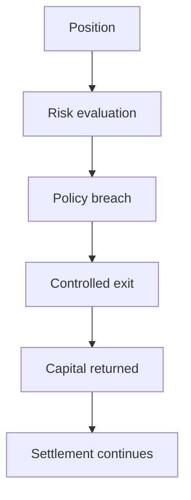

---

# Product Workflow

The complete user journey is designed around one settlement lifecycle:

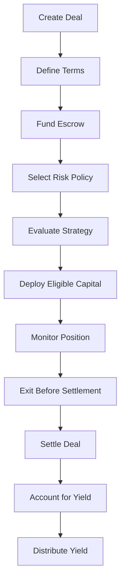

The user should not need to manually operate every underlying DeFi transaction.

The system abstracts protocol complexity while keeping the important financial state visible.

---

### Strategy selection principle

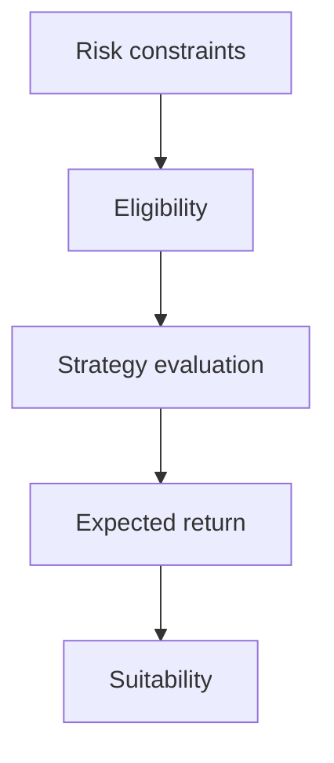

Not:

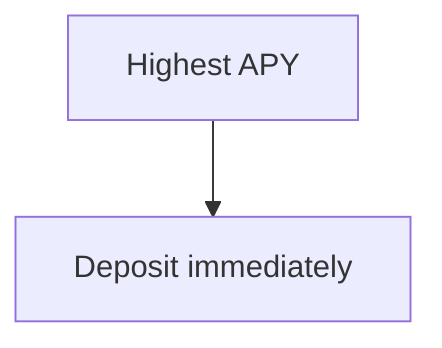

---

# DeFi Yield Layer

The initial strategy layer focuses on **Aave**.

Conceptually:

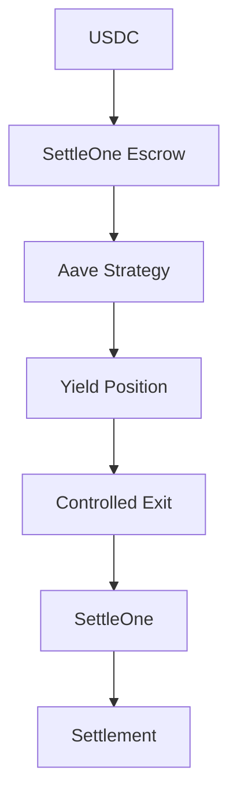

The strategy layer is designed around an abstraction so that additional strategies can be introduced without rewriting the entire settlement system.

Potential future strategies may include other lending or liquidity protocols, but additional integrations should only be introduced when they satisfy SettleOne's risk and settlement requirements.

---

# The Graph Data Layer

The Graph provides indexed blockchain data that can feed SettleOne's monitoring and analytical systems.

Conceptually:

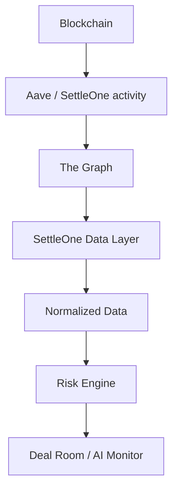

The data layer can provide information such as:

- protocol activity;

- position state;

- liquidity-related metrics;

- historical events;

- transaction activity;

- strategy state;

- settlement-related blockchain events.

The exact data available depends on the deployed subgraphs and supported protocol data sources.

---

# AI Risk Monitor

SettleOne's AI layer is designed as a **risk interpretation and monitoring system**, not an autonomous financial agent.

The AI can:

- explain risk signals;

- summarize position health;

- identify unusual patterns;

- describe why a strategy may no longer satisfy a policy;

- convert technical risk information into understandable language;

- provide monitoring summaries.

Example:

> **Position healthy**

> Current position remains within the configured risk policy. No action is required.

Or:

> **Risk detected**

> Available liquidity has moved below the configured threshold. The position should be exited according to the deal's risk policy.

---

# Automated Risk Response

Risk response should be deterministic wherever possible.

Conceptually:

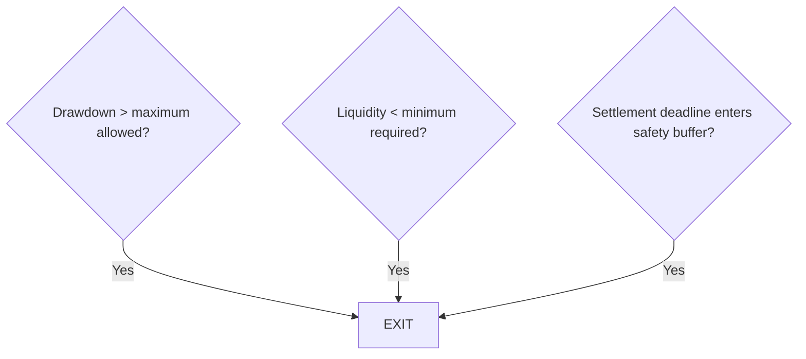

Where oracle/automation infrastructure is appropriate, SettleOne may integrate services such as Chainlink.

Integrations should be used because they provide a real architectural requirement—not merely for technology branding.

---

### Important

Yield is **not guaranteed**.

The system must account for:

- positive yield;

- zero yield;

- strategy losses;

- fees;

- withdrawal costs;

- protocol losses;

- execution costs.

---

# Settlement

Settlement remains the primary objective.

A yield position should not be allowed to compromise the ability to complete the underlying transaction.

Conceptually:

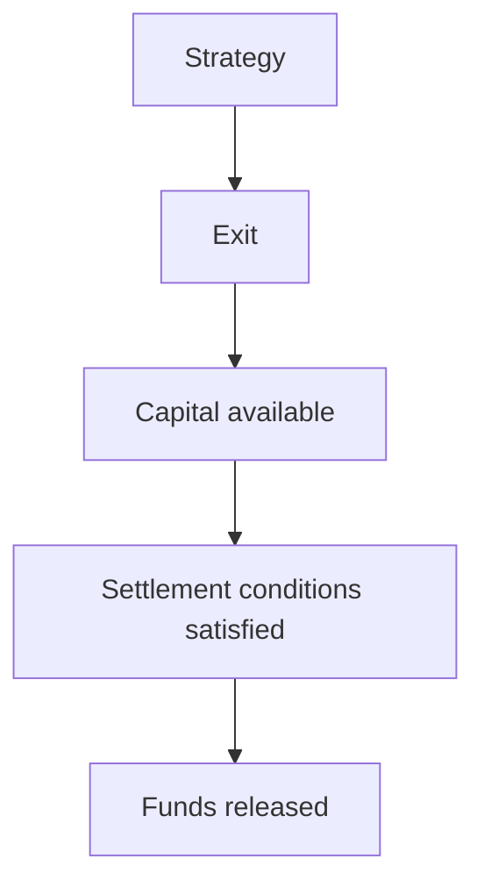

The settlement layer should remain independent from the AI layer.

---

---

# System Architecture

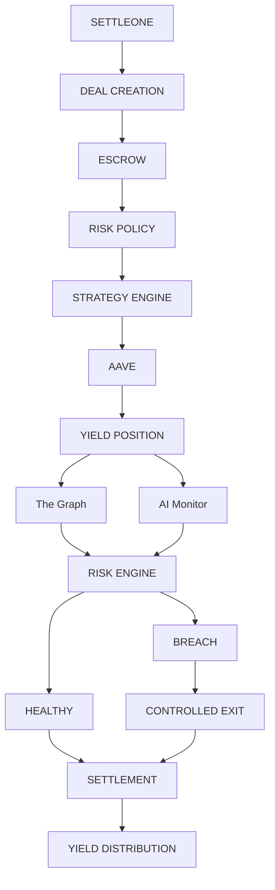

---

### Escrow

Responsible for receiving funds, maintaining deal state, tracking escrow ownership, and enforcing release conditions.

### Settlement

Responsible for completing the underlying transaction, releasing funds according to settlement rules, and coordinating final deal state.

### Risk Policy

Defines permitted risk parameters.

### Strategy Manager

Controls which strategies can be interacted with.

### Aave Strategy

Encapsulates Aave-specific interactions.

### Yield Distributor

Handles accounting and distribution according to the configured mechanism.

### Exit Manager

Provides a controlled path for unwinding eligible strategy positions.

---

# Security Model

SettleOne uses defense-in-depth.

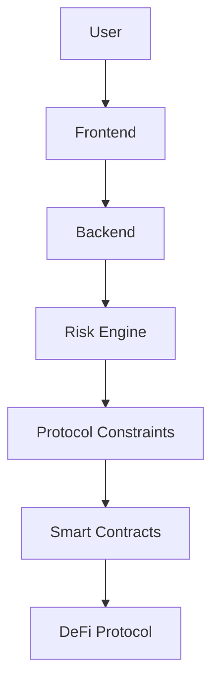

No single application layer should be treated as the sole security boundary.

### Critical principles

- Smart contracts enforce critical financial constraints.

- Backend services do not replace contract-level security.

- AI does not receive unrestricted custody.

- Strategy interactions are explicitly controlled.

- Risk policies are explicit.

- External protocol risk remains visible to users.

---

# Risk & Loss Model

SettleOne **does not eliminate DeFi risk**.

Potential risks include:

- **Smart-contract risk:** A vulnerability in SettleOne or an integrated protocol.

- **Protocol risk:** Aave or another integrated protocol could experience an exploit.

- **Market risk:** Asset values or market conditions can change.

- **Liquidity risk:** Capital may not always be withdrawable at the expected price or speed.

- **Oracle/data risk:** Incorrect, delayed, manipulated, or unavailable data can affect monitoring.

- **Execution risk:** Transactions can fail, revert, become delayed, or incur unexpected costs.

- **Network risk:** Congestion, outages, reorgs, or chain-level issues.

- **Strategy risk:** A strategy can underperform or lose value.

### Who bears the loss?

This must be explicitly defined by the deployed deal's legal and protocol terms. **SettleOne should never represent strategy principal as guaranteed unless an actual protection mechanism exists.**

---

# Technology Stack

## Frontend

- React

- TypeScript

- Tailwind CSS

- shadcn/ui

- wagmi

- RainbowKit

- viem

## Backend

- Node.js

- TypeScript

- Fastify

- Zod

- PostgreSQL

## Infrastructure

- Redis

- BullMQ

- Socket.IO / WebSockets

- Docker

## Blockchain

- Solidity

- Foundry

- EVM-compatible blockchains

## Data & External Services

- The Graph

- Pinata IPFS (Decentralized storage)

- AWS S3 (Encrypted Blob Storage)

- Nodemailer (Auth emails)

---

# Contract Addresses

> **Deployment information should be maintained here once production/testnet deployments are finalized.**

[**View Contract Addresses & Deployment Details →**](https://settle-one-marketing.vercel.app/docs)

# Security Disclosure

If you discover a potential security vulnerability, do not publicly disclose exploit details before the issue has been assessed and addressed.

Security-sensitive reports should be directed through the project's designated private security-reporting channel.

Do not publish private keys, credentials, API secrets, unpublished vulnerabilities, or exploit code targeting production deployments.

---

# License

SettleOne source code is intended to be distributed under the **Business Source License 1.1 (BUSL-1.1)** or the applicable repository-specific license.

The license for each repository must be checked in that repository's \\`LICENSE\\` file. BUSL-1.1 is intended to provide source availability while restricting certain forms of production use.

**Do not assume that public source code means unrestricted commercial use.**

Third-party dependencies, libraries, protocols, SDKs, and integrations remain subject to their own respective licenses and terms.